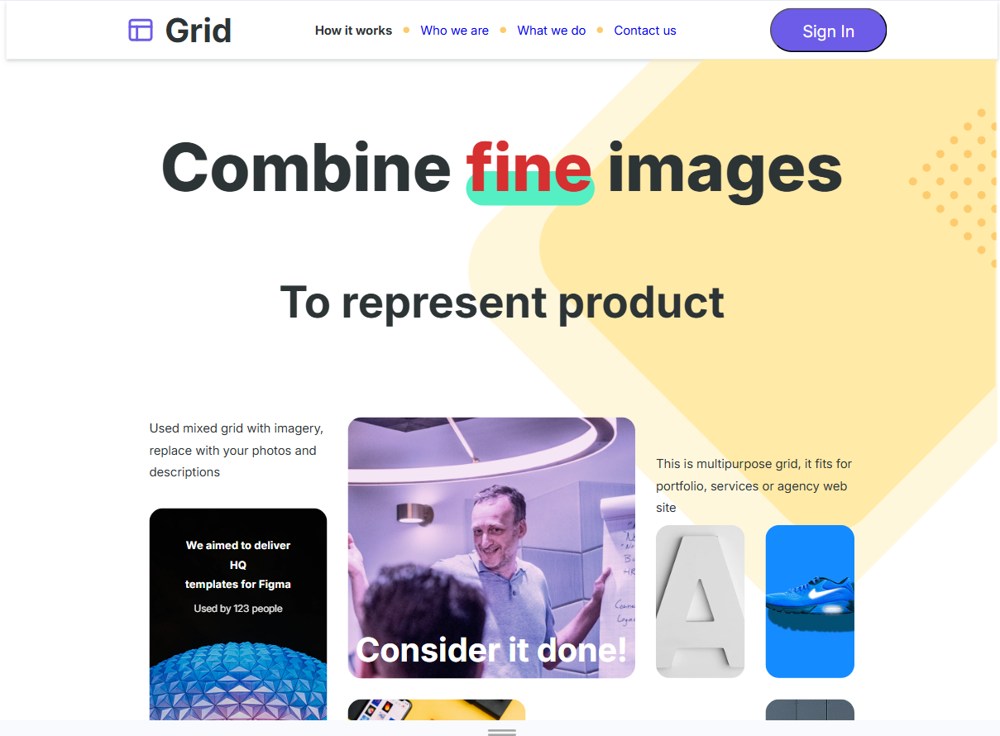
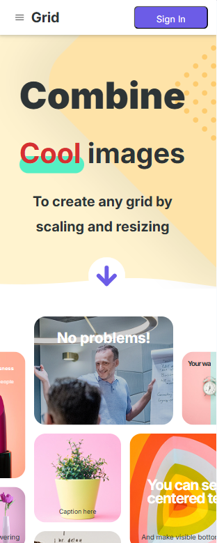

# 📐 **Grid Design — адаптивный лендинг**

## 🔗 Live Demo
👉 https://whalter26.github.io/GridDesign/

---

## 🖼 Preview

### 🖥 Desktop

### 📱 Mobile

### Full page

---

Мой первый полностью самостоятельный проект (без использования шаблонов и туториалов), созданный по найденному в интернете макету.  
Проект выполнен для практики **адаптивной вёрстки**, **CSS Grid**, **Flexbox**, позиционирования и построения **UI-системы**.

Сайт разработан **с нуля**, без фреймворков.  
Поддерживает **desktop-версию** и **отдельную mobile-версию**, а не просто масштабирование.

---

## ✨ **Основные особенности**

### 🎨 **Сложная адаптивная вёрстка**
- Несколько breakpoint-ов  
- Отличающиеся layout-ы для мобильных и desktop-устройств  

### 📱 **Полноценный мобильный интерфейс**
- Не уменьшенная копия desktop  
- Упрощённые сетки, изменённые компоненты, оптимизация для тач-управления  

### 🖼 **Необычная композиция с использованием CSS Grid**
- Активное применение `grid-template-areas`  
- Комбинация Grid + Flexbox  

### 🧩 **Компонентный подход в CSS**
- Единая система переменных  
- Модификаторы  
- Логичная структура и переиспользуемые элементы  

### 🎯 **Современные техники**
- `clamp()` для адаптивной типографики  
- `object-fit`  
- Кастомные CSS-переменные  
- Собственный reset + нормализация  

### 💎 **Внимание к визуальным деталям**
- Типографика  
- Точные отступы  
- Сетка и визуальный баланс  

### 🖍 **SVG-иконки**
- Приведены к `currentColor` для удобной стилизации

---

## 🛠 **Технологии**

- **HTML5**  
- **CSS3**  
- **CSS Grid / Flexbox**  
- **SVG**  
- **Адаптивная и отзывчивая вёрстка**  
- **CSS-переменные**  
- **UI-компоненты и модификаторы**
